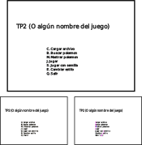

# TP2

Se pide implementar un juego simple por consola jugable por 2 jugadores a la vez **reutilizando los TDAs implementados durante la cursada**.

## Funcionalidad pedida

Para iniciar el juego, puede invocarse tp2 con el archivo de pokedex a utilizar o no. Al ejecutarse el tp2, si fue provisto un archivo, se carga y dicho archivo puede ser utilizado para jugar. Al iniciar el programa se presenta un menú al usuario con las siguientes opciones:

  - (C) Cargar archivo: Pide al usuario un nombre de archivo para cargar
  - (B) Buscar: Se muestra un submenú con las siguientes opciones
    - (N) Buscar por nombre: Pide al usuario un nombre y busca en la pokedex los pokemones con ese nombre
    - (I) Buscar por ID: Pide al usuario un id y busca en la pokedex los pokemones con ese id
    - (A) Menú anterior: Vuelve al menú anterior
  - (M) Mostrar: Se muestra un submenú con las siguientes opciones
    - (N) Mostrar por nombre: Muestra los pokemones de la pokedex ordenados por nombre
    - (I) Buscar por ID: Muestra los pokemones de la pokedex ordenados por id
    - (A) Menú anterior: Vuelve al menú anterior
  - (J) Jugar: Inicia el juego
  - (S) Jugar con semilla: Pide al usuario un número para utilizar como semilla e inicia el juego
  - (E) Cambiar estilo: Cambia el estilo de dibujado del menú (cada vez que se selecciona se utiliza el siguiente estilo, se deben implementar por lo menos 3 estilos diferentes)
  - (Q) Sale del juego

  

## Descripción del juego

El juego es un clásico juego de memoria. Se presentan 18 cartas boca abajo (tomadas al azar del archivo cargado), cada una identificada por un numero. Los jugadores van tomando turnos y seleccionan dos cartas. Se muestran ambas cartas (por ejemplo Pikachu y Charmander). Si las cartas son iguales, el jugador gana un punto y puede seguir seleccionando pares. Si son diferentes, se pasa el turno al otro jugador.

Cada vez que se forma un par, dicho par queda eliminado. El juego termina cuando no hay mas pares.

La zona de juego debe mostrar las cartas disponibles y las últimas 5 jugadas realizadas.

Al finalizar el juego se debe mostrar el resultado: debe incluír el punaje de cada jugador y un listado de cada una de las jugadas realizadas separadas por jugador.

## Consideraciones extra

Para este trabajo hay 4 cosas importantes:

  - Que el alumno **pueda demostrar que comprende cómo funcionan y en qué momento conviene utilizar cada uno de los TDA implementados durante la materia**.
  - La presentación y usabilidad del juego.
  - La presentación y legibilidad del código.
  - No se permite la utilización de bibliotecas externas (SDL, ncurses, sarasa). Si alguno quiere hacerlo puede hacerlo de forma optativa, es obligatorio que el trabajo entregado funcione sin requerimientos externos.

  Se propone prestar atención a la presentación y se recomienda implementar todos los TDA que crea necesarios para mejorar la presentación tanto del juego final como del código. Como mínimo, se pide implementar el TDA Menú. Dicho TDA debe ser reutilizable para cualquier TP futuro (no solo para este) sin modificaciones.

  Tener en cuenta que por mas que en esta oportunidad, al no existir una interfaz común a implementar, el bot de entregas no correrá pruebas automatizadas para probar el código. Sí se corren las pruebas del usuario y es importante que se pruebe la funcionalidad implementada.

## Parte teórica

Explicar los siguientes puntos (no necesariamente en orden, pero por favor usando diagramas):

   - ¿Qué TDAs fueron utilizados para implementar las funcionalidades pedidas? ¿Por qué fue elegido ese TDA y no otro?
   - Explicar el TDA menú. Justifique las operaciones incluídas en el TDA.
   - Explicar cualquier otro TDA o estructuras auxiliares implementadas.
   - Explique qué dificultades encontró al implementar el TP2 y cómo pudo solucionarlas.
